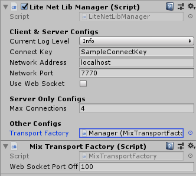

# Custom Transport Layer

This library will use `LiteNetLib` for transport layer by default, If you want to change it to other, you have to write your own transport based on `LiteNetLibManager.ITransport` interface with its factory based on `LiteNetLibManager.BaseTransportFactory` to make it easily to switch manager's transport layer

### How To Change Transport Layer

Add factory component to any game object or the same game object which network manager attached, then drag added factory component to network manager -> `Transport Factory`.

### ENet Transport Layer

You can get ENet Transport from (https://github.com/insthync/LiteNetLibManager_ENET)

### KCP Transport Layer

You can get KCP Transport from (https://github.com/insthync/LiteNetLibManager_KCP)

### WebSocket Transport Layer

This transport layer is included with the project, developer can set `Use Web Socket` to `TRUE` to use `WebSocket` as transport layer, WebGL client will be forced to use `WebSocket`.

### Mix Transport Layer

This transport layer is included with the project, it's mix of `LiteNetLib` and `WebSocket`. it will run `LiteNetLib` and `WebSocket` at same as the server but difference port, WebSocket port offset can be set at its factory (`MixTransportFactory` component). it will use `WebSocket` when game running for `WebGL` client, for other platforms it will use `LiteNetLib` as transport layer.

From the image above, `Web Socket Port Offset` is `100`, `Network Port` is `7770` when server running it will run `LiteNetLib` server at port `7770` and run `WebSocket` server at port `7870` at same time.