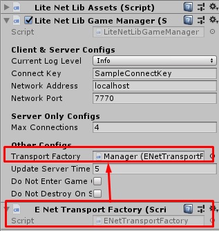

# Custom Transport Layer

This library will use `LiteNetLib` for transport layer by default, If you want to change it to other, you have to write your own transport based on `LiteNetLibManager.ITransport` interface with its factory based on `LiteNetLibManager.BaseTransportFactory` to make it easily to switch manager's transport layer

### How To Change Transport Layer

Add factory component to any game object or the same game object which network manager attached, then drag added factory component to network manager -> `Transport Factory`

### ENet Transport Layer

You can get ENet Transport from (https://github.com/insthync/LiteNetLibManager_ENET)

### Websocket Transport Layer

Under Construction