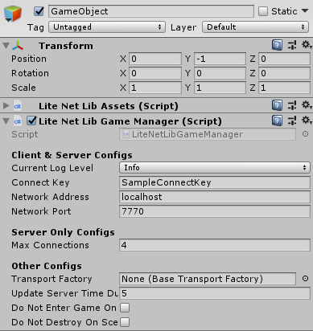
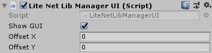
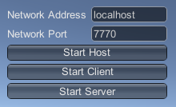
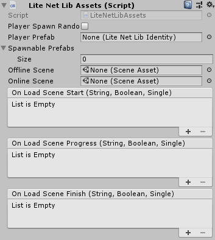

# LiteNetLibGameManager

`LiteNetLibGameManager` is the core controlling component of a multiplayer game. To get started, create an empty `GameObject` in your starting Scene, and add the `LiteNetLibGameManager` component. The newly added `LiteNetLibGameManager` component looks like this:

`LiteNetLibGameManager` configs:
- `Connect Key`, is key for validate connections. When connect, client have to send the key to server to validate, if it's valid client will able to connect to server
- `Network Address`, address for client to connect to server
- `Network Port`, port for server or host to serve and for client to connect to server
- `Max Connections`, maximum amount of connections / players allowed
- `Transport Factory`, reference to transport factory component which use for create transport layer networking system
- `Update Server Time Duration`, duration to update current server time to clients
- `Do Not Enter Game On Connect`, if this is `TRUE` it will not enter game (not change scene to the server's scene) when connected to server, so developer have to call `LiteNetLibGameManager.SendClientEnterGame()` function to enter game, you can know client connection status from `LiteNetLibGameManager.IsClientConnected`, `LiteNetLibGameManager.OnClientConnected()` and `LiteNetLibGameManager.OnClientDisconnected()`
- `Do Not Destroy On Scene Changes`, if this is `TRUE` the `GameObject` which the manager added to will not be destroyed when changed to offline scene

You can add `LiteNetLibManagerUI` as viewed in the `Game` view which display simple buttons for connections

*The `LiteNetLibManagerUI`, as viewed in the `Game` view*

When you're writing your scripts for connections, you'll have to call following functions:
- `LiteNetLibGameManager.StartServer()` to start game as server only
- `LiteNetLibGameManager.StartClient()` to start game as client only
- `LiteNetLibGameManager.StartHost()` to start game as host which start both server and client
- `LiteNetLibGameManager.StopServer()`, to stop when running as server
- `LiteNetLibGameManager.StopClient()`, to stop when running as client
- `LiteNetLibGameManager.StopHost()`, to stop when running as host. It will stop both server and client, so you can use this to stop when running as server or client too

There are following event functions that overrideable:
- `LiteNetLibGameManager.OnPeerNetworkError()`, Called on the server when a network error occurs for a client connection.
- `LiteNetLibGameManager.OnPeerConnected()`, Called on the server when a new client connects.
- `LiteNetLibGameManager.OnPeerDisconnected()`, Called on the server when a client disconnects.
- `LiteNetLibGameManager.OnClientNetworkError()`, Called on clients when a network error occurs.
- `LiteNetLibGameManager.OnClientConnected()`, Called on the client when connected to a server.
- `LiteNetLibGameManager.OnClientDisconnected()`, Called on clients when disconnected from a server.
- `LiteNetLibGameManager.OnStartClient()`, This is a hook that is invoked when the client is started.
- `LiteNetLibGameManager.OnStartHost()`, This hook is invoked when a host is started.
- `LiteNetLibGameManager.OnStartServer()`, This hook is invoked when a server is started.
- `LiteNetLibGameManager.OnStopClient()`, This hook is called when a client is stopped.
- `LiteNetLibGameManager.OnStopHost()`, This hook is called when a host is stopped.
- `LiteNetLibGameManager.OnStopServer()`, This hook is called when a server is stopped.

## Scene Management

When you add `LiteNetLibGameManager` to `GameObject` it will add `LiteNetLibAssets` to the same `GameObject` too, you can use this component to manage scenes and spawning objects

You can set following config for scene management:
- `Offline Scene`, is scene which will changed to when client disconnected from server
- `Online Scene`, is scene which will changed to when client connected to server

You can request all clients to change scene to the same scene as server by function `LiteNetLibGameManager.ServerSceneChange()` while the game running as server or host

When change scene it uses `SceneManager.LoadSceneAsync()` function and there are following events that you can use to show scene load states:
- `On Load Scene Start(sceneName, isOnlineScene, progress)`, you can use this event to show loading screen
- `On Load Scene Progress(sceneName, isOnlineScene, progress)`, you can use this event to update loading progress
- `On Load Scene Finish(sceneName, isOnlineScene, progress)`, you can use this event to hide loading screen

## Spawn Management

In `LiteNetLibAssets` you can set following configs for spawn management:
- `Player Spawn Randomly`, if this is `TRUE` players will be spawned to random `LiteNetLibSpawnPoint`, if this is `FALSE` it will be spawned by order of `LiteNetLibSpawnPoint`
- `Player Prefab`, this is reference to `LiteNetLibIdentity` which will be spawned when player connect and enter game as player character, you should set the character here
- `Spawnable Prefabs`, this is reference to an `LiteNetLibIdentity` that will be spawned while gameplay at server side, you can set an player character, non player character or bullets here

When player connected to the server and changed scene to server scene it will send client ready message to server to spawn player. If you want to changes how to spawn player, you may make `Player Prfab` empty then override `LiteNetLibGameManager.DeserializeClientReadyExtra()` function to spawn player, if you want to write more data which required to spawn player you can override `LiteNetLibGameManager.SerializeClientReadyExtra()` function then data you write it will be read in `LiteNetLibGameManager.DeserializeClientReadyExtra()` function

You can spawn objects that set in `Spawnable Prefabs` by function `LiteNetLibAssets.NetworkSpawn()` and destroy by function `LiteNetLibAssets.NetworkDestroy()`