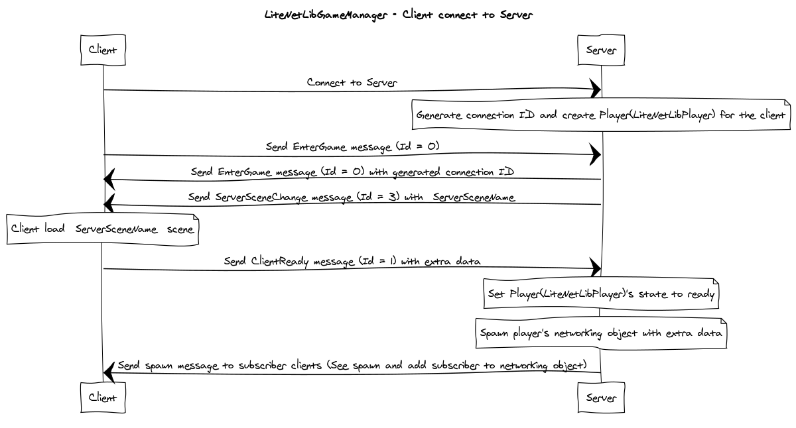

# How does it work - Part 2

In this part I will explains about how `LiteNetLibGameManager` server and client connect together, whats server do when client connect and whats client do when receives response from server.

`LiteNetLibGameManager` is a class which derived from `LiteNetLibManager` extends functionality to manage networking object spawn and destroy, subscribe and unsubscribe spawned networking object for specific client, sync scene to be the same with server, sync networking object data (SyncField, SyncList) to be the same with server and call networking function from client to server and from server to clients.

## Connection workflow

When client connect to server, the server will generate connection ID and create `LiteNetLibPlayer` object for the client to manage subscribing networking objects later. And client also send `EnterGame(Id = 0)`  message to server.

Then after server recieve `EnterGame(Id = 0)`  message from client, server will send EnterGame (Id = 0) message back with generated connection ID. And also send `ServerSceneChange(Id = 13)`  message with `ServerSceneName` to tell client which scene it must load.

Then the client will receive `EnterGame(Id = 0)`  message with connection ID, it will set connection ID to `ClientConnectionId` which will be used later with networking objects. And will receive `ServerSceneChange(Id = 13)`  message with scene name then client will load that scene. So client's scene will be the same scene with server.

After the scene loaded, client will send `ClientReady(Id = 1)` message to server with some extra data which developer can define an extra data in classes which derived from `LiteNetLibGameManager` by override `SerializeClientReadyExtra()` function.

```
public class ExtendedGameManager : LiteNetLibGameManager
{
    public string playerName = "Mike";
    public virtual void SerializeClientReadyExtra(NetDataWriter writer)
    {
        writer.Put(playerName);
    }
}
```

Then when server receive `ClientReady(Id = 1)` message from client it will set player's state to ready. After that, it will spawn player's networking object, if the prefab was defined to attached `LiteNetLibAssets` component → `playerPrefab` field. And read an extra data (Which written in `SerializeClientReadyExtra()`) in `DeserializeClientReadyExtra()` function. So developer have to override `DeserializeClientReadyExtra()` to read an extra data.

```
public class ExtendedGameManager : LiteNetLibGameManager
{
    public string playerName = "Mike";
    public override void SerializeClientReadyExtra(NetDataWriter writer)
    {
        writer.Put(playerName);
    }

    public override void DeserializeClientReadyExtra(LiteNetLibIdentity playerIdentity, long connectionId, NetDataReader reader)
    {
        var playerCharacter = playerIdentity.GetComponent<PlayerCharacter>();
        playerCharacter.Name = reader.GetString();
    }
}
```

Then server will add subscribing networking objects to player and add player as subscriber to networking objects and send spawn networking object messages to subscribing clients.

* * *

