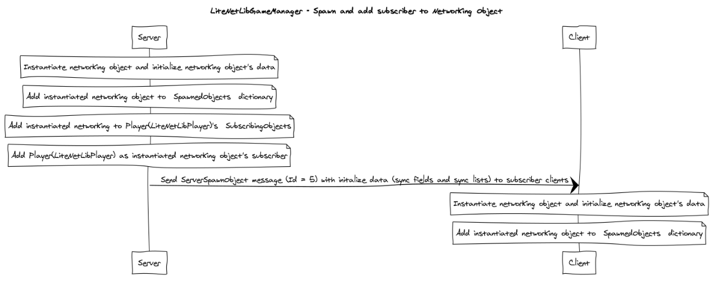
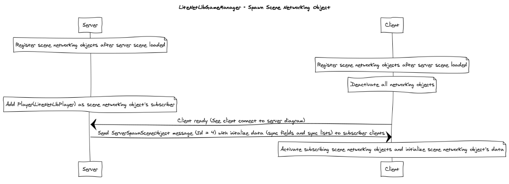
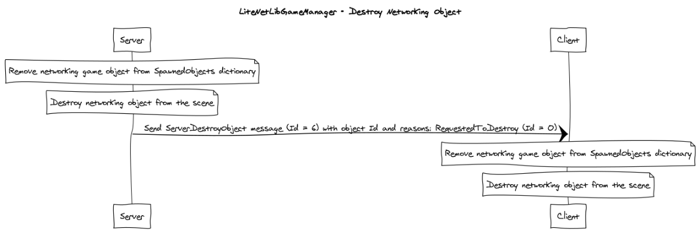
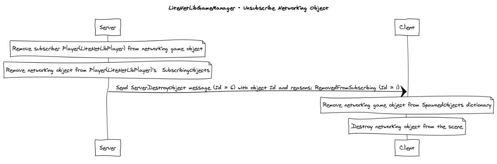

# How does it work - Part 3

In this part I will explains how networking objects will be spawned, will be destroyed, will subscribing and unsubscribing by players. Only server can manage an networking objects then it will sync networking objects to clients.

## About networking object

Networking object is game object which attached `LiteNetLibIdentity`. Networking object itself won't have any syncing data and functionality. Developer you to create behaviour class which derived from `LiteNetLibBehaviour` to add Sync Field, Sync List and Net Function.

Networking object which created in the editor will be **Scene networking object** which will be spawned immediately when server started and loaded scene. its object ID will be defined while editing the scene.

To make networking object be able to creating at runtime, developer have to make it as prefab and add to `LiteNetLibAssets(The component which attached to the same game object with LiteNetLibGameManager)` → `spawnablePrefabs` field. Or register prefab with `RegisterPrefab()` function after server or client started and loaded scene.

## About networking object subscribing

An networking objects can be subscribed or unsubscribed by player (LiteNetLibPlayer) to sync data to subscribed player. Subcribing will be managed by server, its conditions to subscribe/unsubscribe can be defined to behaviour classes (Classes which derived from `LiteNetLibBehaviour`) by override function `ShouldAddSubscriber()` function which will return `true` if object should add player as subscriber and `OnRebuildSubscribers()` function which will add players that should be subscriber to `subscribers` hashset and return `true` if there is any player that can subscribing networking object.

When player subscribing the object, server will send spawn message to the client and when player unsubscribing the object, server will send destroy message to the client.

## Spawn networking object workflow

When `NetworkSpawn()` function called at server, it will prepare object data such as object ID, connection ID, type of object (is scene object or not). Then it will add player as subscriber. And the object added player (`LiteNetLibAssets`) as subscriber, server will send `ServerSpawnObject (Id = 5)` to client with data including with Sync Field, Sync List data.

Then when client receive the message, client will spawn the networking object and set included data.

## Spawn scene networking object workflow

When client or server started and loaded scene it will deactivate scene networking objects. Then server spawn scene networking objects and activate them later. 

After that when client connect to the server. And the object added player (`LiteNetLibAssets`) as subscriber, server will send `ServerSpawnSceneObject (Id = 4)` to client with data including with Sync Field, Sync List data.

Then when client receive the message, client will activate the scene networking object and set included data.

## Destroy networking object workflow

When `NetworkDestroy()` function called at server, then the object will be destroyed, and it will send `ServerDestroyObject (Id = 6)` message with object ID and reason: (`RequestedToDestroy (Id = 0`) to client.

Then when client receive the message, client will destroy the object from the scene. Except that the object is scene object, it will be deactivated.

## Add object to player subscribing list workflow

When the networking object was added to player subscribing list, server will send spawn message with including data to client.

Then when client receive the message, client will spawn the object and set included data.

## Remove object from player subscribing list work flow

When the networking object was removed from player subscribing list, server will send `ServerDestroyObject (Id = 6)` with object ID and reason: (`RemovedFromSubscribing (Id = 1`) to client.

Then when client receive the message, client will destroy the object from the scene. Except that the object is scene object, it will be deactivated.

